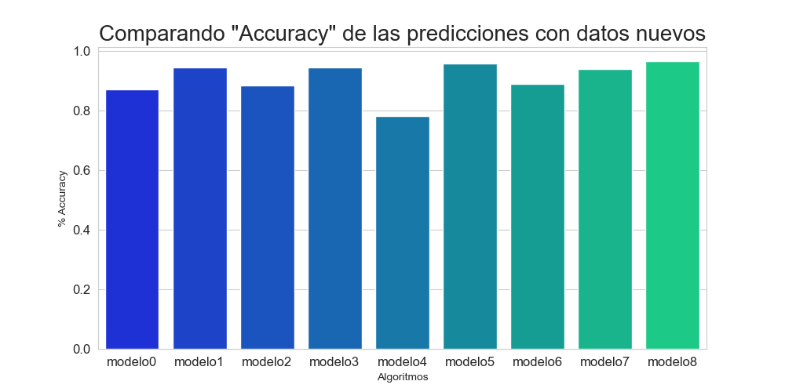

# Grupo Hotusa - Data Scientist Test

El director de Revenue Management nos comenta que las cancelaciones tienen un impacto negativo en los resultados del hotel y se pregunta si con todo esto del Machine Learning y la Inteligencia Artificial seríamos capaces de predecir qué reservas van a cancelar y cuáles no. 

El director quiere poner en marcha este modelo para poder realizar overbooking (llenar el hotel por encima del inventario total disponible con el objetivo de ocupar aquellas reservas que se van a cancelar). El hotel está en el centro de Lisboa y en la misma ciudad el grupo hotelero tiene varios hoteles, por lo que **no hay ningún riesgo en llenar el hotel más de la cuenta** y enviar el exceso de reservas a otros hoteles en la ciudad.

## Descripción de la tarea

El dataset (**hotusa_cancellations.csv**) con el que trabajar contiene las siguientes columnas:
- *HotelId*: Id del hotel
- *ReservationStatusDate*: Fecha en la que se realizó la reserva
- *ArrivalDate*: Fecha de inicio de la reserva
- *LeadTime*: Antelación (días entre la generación de la reserva hasta la fecha de inicio de ésta)
- *StaysInWeekendNights*: Número de noches entre semana
- *StaysInWeekNights*: Número de noches el fin de semana
- *Adults*: Número de adultos en la reserva
- *Children*: Número de niños en la reserva
- *CustomerType*: Tipo de cliente
- *ADR*: Average Daily Rate (precio medio por reserva. Precio total de la reserva dividido por el número de noches)
- *Meal*: Tipo de Alojamiento (BB (Bed and Breakfast), HB (Half Board), Undefined, FB (Full Board), and SC (Self Catering))
- *Country*: País de procedencia del cliente
- *Company*: Compañía del cliente
- *ReservedRoomType*: Habitación reservada
- *IsRepeatedGuest*: Cliente repetitivo
- *IsCanceled*: Booleano que indica si la reserva se canceló o no (TARGET variable)

1. **EDA sencillo y básico** 
Se evalúa cada variable por separado.
Por un lado las variables numéricas y por el otro las categóricas que debemos transformar en numéricas, algunas de ellas con el get_dummies y otras con encoders.
Analizamos cada variable por separado y vemos cómo enfocarla.
Me genera dudas ADR, los precios de las reservas por día, por un lado prefiero los valores reales, por otro lado podría ayudar a los modelos la agrupación de los datos en categorías por bins (disminución del ruído, mejora del rendimiento, simplificación del modelo, reducción de la dimensionalidad…). Me he decidido por mantenerlos tal cual porque no son muchos datos y porque los modelos que mejor funcionan en este caso pueden manejar bien ese volumen de datos. Cuanta más información real podamos aportar al modelo tendremos mayor calidad de datos para alimentarlo.
A partir de las columnas de fechas me pareció interesante sacar los meses por el tema de la estacionalidad, normalmente en verano suele haber más reservas y a lo mejor es un dato que puede ayudar a mejorar la efectividad del modelo. Está claro que las variables relacionadas con la fecha de la estancia de la reserva son importantes a la hora de cancelar las reservas.
Respecto a los outliers, se podrían eliminar pero casi todos los que veo parecen aportar valor, como las reservas de grupos que son pocas pero valiosas, o las reservas anticipadas con mucho tiempo. Por ejemplo hay 3 reservas de habitaciones “A” y 5 de la “L” pero no creo que eliminar las únicas reservas de esas habitaciones ayude... De todas formas serían temas a tratar con los stakeholders porque cada pequeño cambio siempre suma y puede ayudar a mejorar el modelo y sus métricas.
Aparentemente la id del hotel no nos aporta nada, dado que todos los datos son del hotel de Lisboa, la id de usuario tampoco parece ser relevante porque son todos valores únicos. A mayores eliminamos las columnas de fechas después de obtener el mes de la estancia y el mes de la realización de la reserva. A partir de aquí hay variables que parecen aportar poco como el tipo de cliente, el tipo de alojamiento, pero siendo un conjunto de datos no muy voluminoso prefiero dejar todo aquello que pueda aportar algo, aunque sea poco.
Se visualizan las relaciones de las variables entre si con el ProfileReport y con la correlación de Pearson.

2. **Preparación de los datos**
Se normalizan los datos con el MinMaxScaler para poder alimentar a los algoritmos de forma adecuada.

3. **Construcción del modelo**
Para facilitar la toma de decisiones se elabora un bucle para ejecutar varios modelos seguidos y poder compararlos. Según el EDA que se haga funcionarán mejor unos u otros modelos. He optado por mantenerlo simple, según indicaciones del director de Revenue Management. De esta forma con los datos lo más reales posible, ha ganado el MLPClassifier, pero como he dicho anteriormente equilibrando más las poblaciones se consiguen muy buenas métricas de los árboles de decisiones en general, especialmente el GradientBoostingClassifier, seguido muy cerca del RandomForest y del ExtraTreesClassifier...
Ya que el modelo ganador es una red neuronal de un solo perceptrón es muy posible que la mejor solución pase por desarrollar una red neuronal específica para este modelo de negocio donde se puedan tener en cuenta todas las variables que afectan a las cancelaciones y para eso hay que conocer en profundidad el universo de los datos hoteleros y el comportamiento de sus variables.
  
4. **Evaluación del modelo**
Se trata de conseguir un modelo en producción capaz de reducir el 14% de cancelaciones actuales para poder llenar el hotel y llegar al overbooking. Evaluar las métricas obtenidas y posteriormente comprobar el desempeño del modelo en producción con datos nuevos de validación separados anteriormente.

En general funciona bastante bien. Incluso sin modificar los parámetros iniciales.
data\postresampling.png
Accuracy del 96%. 
Recall 88%. 
Precision 97%. 

Consigue un score de 0.9674 y un best_loss de 0.1099 y todo ello con muy poca ayuda, gracias a la calidad de los datos proporcionados. Estos valores asustan un poco porque se acerca a datos que sugieren overfitting. Sin embargo las estadísticas se mantienen bastante bien al probar el modelo con los datos de validación.

5. **Aplicación en streamlit para visualizar los resultados**
Con streamlit se despliega el modelo en producción para ver qué reservas se cancelan y cuales se confirman, de forma que un usuario pueda manejarlo fácilmente.
Se ha implementado el modelo de MLP porque lo considero más "Real" y tiene unas métricas suficientemente buenas. 
Como todo, son mejorables, se pueden tunear los modelos o remuestrear las poblaciones para intentar equilibrarlas mejor. 

6. **Dockerización del proyecto**
Para asegurar que el poryecto es reproducible, portable, consistente, etc... se añade el archivo dockerfile y el docker-compose.yml de forma que se pueda ejecutar el docker-compose up para instalar el proyecto en docker. De esta forma garantizamos que va a funcionar bien en cualquier pc, que es escalable, se puede desplegar rápido y es compatible con la gestión de versiones y con las buenas prácticas en general para un desarrollo ágil y de calidad.
<table>
    <tr>
        <td colspan="3" style="text-align: center; vertical-align: middle;">
            
Matrices de confusión para los modelos de clasificación desarrollados.

        </td>
    </tr>
    <tr>
         <td> Logistic Regression</td>
         <td> Random Forest</td>
         <td> Ada Boost</td>
    </tr>
    <tr>      
        <td></td>
        <td></td>
        <td></td>
    </tr>
    <tr>
         <td> Extra Trees</td>
         <td> SGD </td>
         <td> Gradient Boosting</td>
    </tr>
    <tr>
        <td></td>
        <td></td>
        <td></td>
    </tr>
    <tr>
         <td> SVC</td>
         <td> KNeighbors </td>
         <td> MLP </td>
    </tr>
    <tr>
        <td></td>
        <td></td>
        <td></td>
    </tr>
</table>
